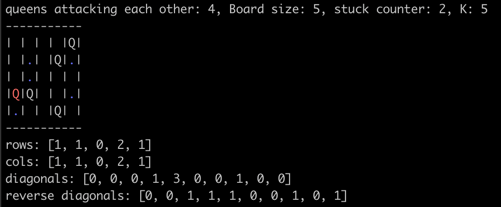
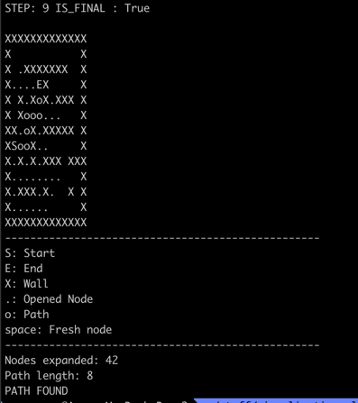

Collection of interesting algorithms and their visualization related to path finding and ML/AI.

## N queens
Find a position of N queens with N sized board where no queens attack each other.

## Path finding visualization
Find a path in a maze, A*, BFS, DFS, Djinkstra, Greedy

