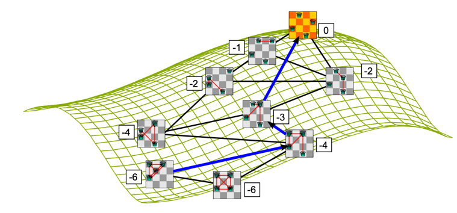

# N queens

The goal is to find 1 position of an n sized chessboard where n queens are not attacking
each other.

This code also visualized the solution step by step.

It's not recommended to run visualization in Pycharm, it's better in a normal terminal, because Pycharm ignores 
`os.system("clear")` command.

## Hill algorithm with the steepest ascending

The algorithm to solve this problem is called Hill algorithm, where you pick a random point in
a space withing some distance of the last point, and if the point is closer to the goal, it gets stored as
the best one.

For the n queens problem, we always pick a random queen, and put it to a random square on the board. 
If less queens attack each other (or same amount), we actually make the move on the board. This algorithm is improved
with the steepest ascending version, where we also pick n random places for the queen and select the best move.

We'll get closer and closer to the result, until we find a position where 0 queens attack each other.

## Config
* board_size - dimension of the board and how many queens to solve with
* visualize - whether to visualize or just solve the problem
* use_resets - experimental, whether to reset if we get stuck for some time with finding the best position. It's better if it's false
* time_sleep - only active when visualize=true, how much to wait between each step of the visualization

## Optimization
This algorithm is optimized to solve up to 1000x1000 board size. It can solve 100x100 in seconds. The queens are stored
as vectors of rows, columns, diagonals and anti-diagonals, where each new move calculations are done in O(1) time.
This algorihm is inherently random, you can expect up to 10x differences in speed of finding solutions between different runs.